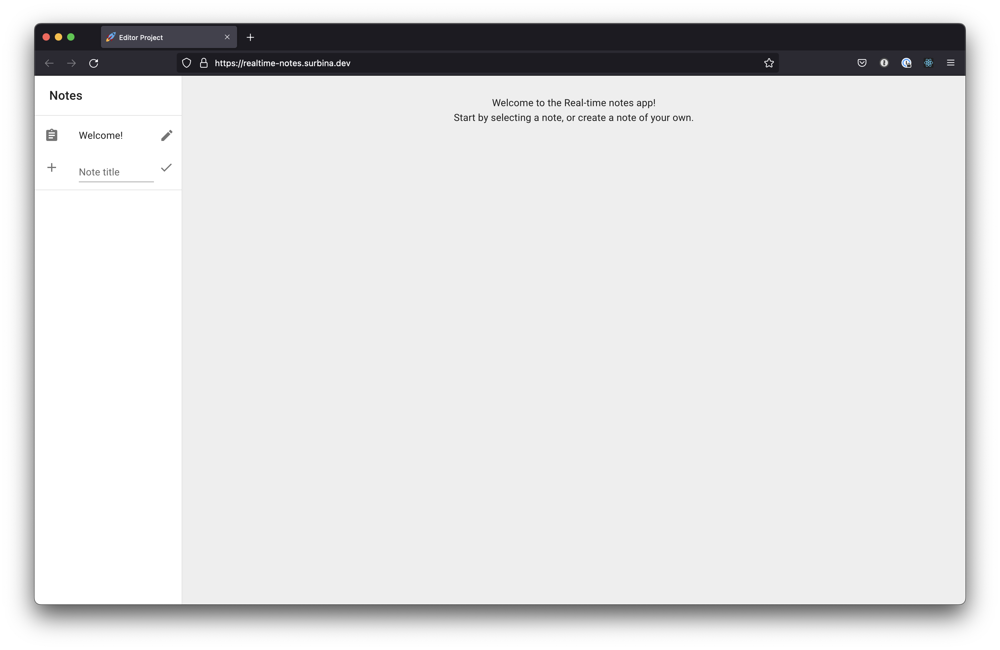

# Real-time notes

Real-time notes is a rich text editor that supports collaborative editing built entirely in Typescript.

You can check out a live version of the app here: [https://realtime-notes.vercel.app](https://realtime-notes.vercel.app)



## Engines

This project was built using the following engines:

- NodeJS v16.15.1
- NPM 8.11.0

Be sure to use a compatible version when running it

## Set up instructions

To set up the project for development, start by cloning the repository:

```bash
git clone https://github.com/surbina/realtime-notes.git
cd realtime-notes
```

Then, install the repo dependencies:

```bash
npm i
```

To run the app, you'll need to [create a Firebase app](https://firebase.google.com/docs/web/setup). Then make a copy of the `.env.template` file, and remove the `.template` suffix from the name.

Then you'll need to get a [Firebase Service Account](https://firebase.google.com/support/guides/service-accounts) and a a [Firebase Config](https://firebase.google.com/docs/web/setup). Once you have those, you should stringify them and store them in `FIREBASE_SERVICE_ACCOUNT` and `NEXT_PUBLIC_FIREBASE_CONFIG` env variables from your `.env` file.

Finally run the following command to populate the env variables:

```bash
source .env
```

## Run instructions

After installing your project, you should be able to execute it by running the following command:

```bash
npm run dev
```

## Tech stack

Below you can find a list of the core technologies used in this project together with a short description of their purpose in the project.

- [NextJS](https://nextjs.org/): Javascript framework for building apps that supports SSR out of the box.
- [Slate](https://docs.slatejs.org/): Rich text editor with support for React.
- [slate-yjs](https://github.com/BitPhinix/slate-yjs): provides a collaboration solution to be used with Slate.
- [MaterialUI](https://mui.com/): Component library that follows [Material design](https://material.io/).
- [Hocuspocus](https://tiptap.dev/hocuspocus): NodeJS backend that implements collaborative features using CRDT data structures provided by [Yjs](https://docs.yjs.dev/).
- [Firestore](https://firebase.google.com/docs/firestore/): Realtime NoSQL database.
- [Playwright](https://playwright.dev/): Testing framework to run integration tests in multiple browsers.
- [Fly.io](https://fly.io/): Service used to deploy the backend server.
- [Vercel](https://vercel.com/): Service used to deploy the frontend server.

## Deployments

Deployments are handled automatically using [Fly.io](https://fly.io) and [Vercel](https://vercel.com). Each time we push to master, a Github action will clone the project, build a docker image with the backend code, push the image to the Fly registry, and start the server. At the same time, when we push to master Vercel takes care of deploying the frontend app.

## Running integration tests

To run the integration tests, be sure the app is running and the `E2E_APP_URL` is populated. Then, from the project root run:

```bash
npm run test:e2e
```

## TODO/Future work

There a number of feature I would have love to implement, but I couldn't due to time restrictions

- Add delete note support
- Reduce number of WebSocket connections
- Adopt one styling solution and use across the project (for consistency)
- Handle API errors in the frontend
- Run checks before deployments in the CI
- Run integration tests when pushing commits to master in the CI

## Repository structure

We follow the monorepo pattern:

- [apps](apps) contains executable and deployable packages:
  - [frontend](apps/frontend) contains the user facing Next.JS app.
  - [backend](apps/backend) contains the backend express app.
- [integration-tests](integration-tests) contains the integration test suite implemented using Playwright

## Type checking and linting

Each app has a `check` script that runs the linting and typechecking. Run it in all apps from the root by running: `npm run check --workspaces`.
